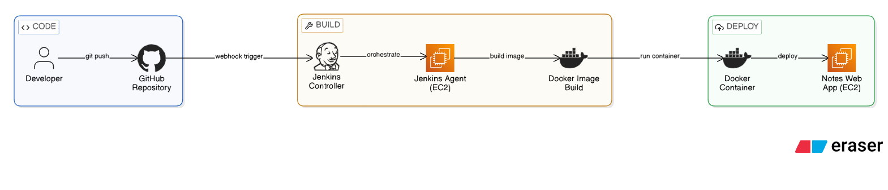

# Notes App DevOps Project

This is a simple Notes Application built using:

HTML  
CSS  
JavaScript  

The application is containerized using Docker and deployed automatically using a Jenkins CI/CD pipeline on AWS EC2.

---

## Architecture

The diagram above represents the deployment architecture and CI/CD workflow used in this project.

---

## DevOps Stack

- GitHub  
- Jenkins  
- Docker  
- AWS EC2  

---

## CI/CD Workflow

1. Developer pushes code to GitHub  
2. GitHub webhook triggers Jenkins  
3. Jenkins pipeline runs on an EC2 agent  
4. Docker image is built  
5. Container is deployed on EC2  
6. Updated application becomes live automatically  

---

## Learning from this Project

Through this mini project, I gained practical understanding of several DevOps concepts:

- Containerizing applications using Docker  
- Creating and configuring Jenkins pipelines  
- Automating deployments using CI/CD  
- Using GitHub webhooks to trigger builds  
- Deploying containerized applications on AWS EC2  
- Understanding the interaction between source control, CI/CD tools, and cloud infrastructure  

This project helped me understand how DevOps tools integrate together to automate application delivery.